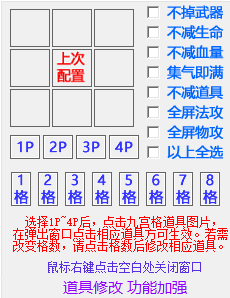
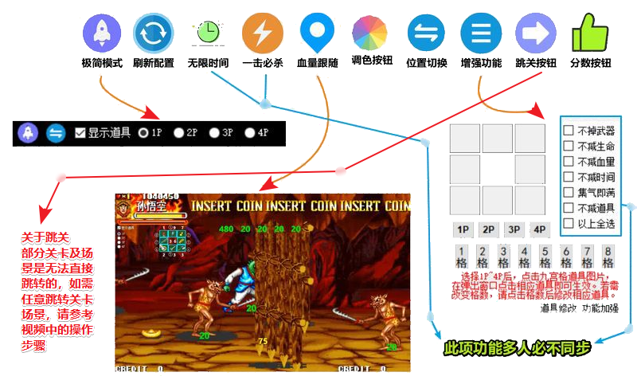

## README

### [点我直接下载](https://gitee.com/lindaiyuyu/Game_key/raw/gh-pages/西游释厄传_Ultimate.zip)

### [防闪退版本下载](https://jihulab.com/lindaiyu/Game_key/-/raw/gh-pages/西游释厄传_防闪退.zip)

### [波动配套工具下载](https://gitee.com/lindaiyuyu/Game_key/raw/gh-pages/波动配套工具/WASDJKLI-集气O.zip) 

### [防掉线补丁下载](https://gitee.com/lindaiyuyu/Game_key/raw/gh-pages/Other/Online.zip) 

## 购买方式
- **付款前请联系我**，并提供 **UID、所需功能**，UID为7位数字 
- 请在**授权成功后付款**
- **7天内使用不满意请联系退款**

| **支付宝** | **微信支付**|**QQ会话**|
| :-----: | :-----: | :-----: |
| | | 

## 如何使用
- 打开该软件，进入游戏即可； 或者进入游戏后，再打开该软件

> 如遇软件无法打开，请先关闭杀毒软件或加入信任列表后再次尝试。
如果问题依然存在，请参考：**操作说明 → QQ会话**

## 操作说明
- 软件打开后，生成托盘图标，右键点击托盘图标，弹出菜单内容如下：

| ***菜单项*** | 说明 | 
| :----- | :----- | 
| **QQ会话** | 如果电脑上已经安装了QQ，将发起QQ会话 | 
| **下载帮助** | 使用浏览器打开下载页面 | 
| **联网检测** | 联网检测工具，可检测能否获取更新信息、游戏配置信息等 | 
| **默认设置** | 恢复默认设置和布局 | 
| **刷新授权** | 授权异常可用 | 

## 功能说明
#### 基本功能
|***基本功能***|
| :----- | 
|**时间显示**| 
|**血量显示**| 
|**道具显示**| 

------------

#### 设置功能
|***设置功能***|说明|
| :----- | :----- | 
|**极简模式**| 切换功能按钮布局|
|**位置切换**| 切换血量、时间显示位置|
|**颜色调整**| 鼠标左右键点击调色板，可调整血量颜色|
|**血量跟随**| 角色、怪物可跟随显示血量|

------------

#### 辅助功能
| ***辅助功能***|说明|
| :----- | :----- | 
|**跳关功能**| 点击此按钮默认直接跳转牛神场景|
||在此签名界面选择关卡场景，即可跳转任意关卡、场景|
|||
|**道具配置**| 道具配置，增强功能|
||点击格数和位置配置道具，运行期间保留上次道具配置信息，其他功能请跳转 增强功能|
|||
|**一键波动**| 鼠标**右键**点击此处，出现配置对话框|
||在此处可配置波动触发按键，此功能需与波动配套工具一起食用(不保证每台设备均可用)|
||此功能左右方向为同一触发键，角色面向哪个方向就触发该方向波动|
|||
|**不减时间**| 时间静止|
|**一击必杀**| 怪物必须死|
|**人物无敌**| 永不挨打(看人品)|
|**设置分数**| 这功能一般用不到|

------------

| ***增强功能***|说明|
| :----- | :----- |
|**以上全选**|就是以下功能全选|
|**不掉武器**|武器永不掉|
|**不减生命**|生命数不减|
|**不减血量**|血量值不减|
|**不减道具**|道具数不减|
|**集气即满**|集气即满|
|**全屏法攻**|道具、法术全屏攻击|
|**全屏物攻**|物理全屏攻击|

## 异常处理
> 如果依然出现以下问题，请**直接发起QQ会话**。

| 异常类型 | 解决方法 | 
| :----- | :----- | 
| **无法运行** | 请关闭 杀毒软件 | 
| **联网检测失败** | 请使用 联网检测工具 检查网络是否畅通 | 
| **程序校验失败** | 请使用 联网检测工具 检查网络是否畅通 | 
| **授权过期** | 请使用 联网检测工具 检查网络是否畅通；并确认是否续购授权 | 
| **未授权** | 请使用 联网检测工具 检查网络是否畅通；并确认是否购买授权 | 

## 软件升级
- 软件每次启动会检测版本变更。
- 检测到新版本信息及更新内容后，点击确定后将会在浏览器打开**下载页面**，直接下载即可。

## 直播及多开使用说明

### **自动点击计时器**
>> 该选项支持 《**OnlyStopWatch**》秒表计时软件，支持**自动复位**，**自动计时**，**通关自动暂停**，如果需要，请选择该菜单下的选项

> 只多开游聚，不涉及直播
>> 1. 辅助下载后直接运行，什么都不用管，辅助会显示在先进入房间的窗口上； 
>> 2. 唯一的前提是确保多个账号均已授权； 

> 直播
>> 1. 辅助下载后直接运行 (或辅助重命名为《**左以及你的UID**》，如《左1234567》，**UID为7位数字** 可避免多开游聚时出现未授权弹窗) 
>> 2. 如果已重命名或者使用OBS-Studio则无需此步骤；如果没有，先鼠标右键点击辅助右下角托盘图标，在弹出的菜单中找到并勾选《**打开直播支持**》
>> 3. 请参考直播软件操作

> **多开游聚，且需要多窗口直播** (请确保多账户已授权)
>> 1. 请复制出2个辅助复件到你的目录下，分别命名为 《**左以及你的UID**》《**右以及你的另一个UID**》，如《左1234567》《右7654321》。**UID为7位数字** 
>> 2. 运行左右2个辅助；(左右辅助默认开启直播支持，其中，为了避免重复点击计时软件，右辅助默认不开启自动点击计时器)
>> 3. 请参考直播软件操作

> **直播软件操作**
>>
>> Tips: 有多开需求的情况下，建议单开、多开分别配置不同的场景，便于快速切换。
>>
>> **抖音直播伴侣**
>>> 1. 添加素材 --> 游戏进程 --> 选择对应的游戏进程，多开需多次添加
>>> 2. 添加素材 --> 窗口 -> [西游释厄传_Ultimate.exe] (如果是多开，请选择对应的进程窗口名称即可，如《左1234567》) --> 点击高级设置  --> 绿幕抠图 --> 将 相似度 拉到最左边即可。
>>> 3. 现在可以在预览窗口中看到，游戏和辅助信息都已经正常显示，按照你自己的习惯，拖放到适合的大小和位置。
>>> 4. 多开请重复 步骤1、2、3

>> **OBS-Studio**
>>> 1. 来源 --> 添加游戏源 --> 模式 > 采集特定窗口 --> 窗口 -> [X-Zone.exe]:西游释厄传(*) --> 其他默认，直接点击确定就好。
>>> 2. 来源 --> 添加窗口采集 --> 窗口 -> [西游释厄传_Ultimate.exe] (如果是多开，请选择对应的进程窗口名称即可，如《左1234567》) --> 其他默认，直接点击确定就好 --> 此时在预览中可以看到，辅助窗口的背景颜色为不透明的黑色，接下来进行第3步
>>> 3. 点击第2步中添加的条目 --> 点击滤镜 --> 点击加号+ --> 选择 色值 确定 --> 在 关键的颜色类型中 下拉列表中选择 自定义颜色 --> 点击选择颜色，在弹出的颜色选择器中点击左上角的黑色后确定
>>> 4. 多开请重复 步骤1、2、3
>>> 5. 现在可以在预览窗口中看到，游戏和辅助信息都已经正常显示，按照你自己的习惯，拖放到适合的大小和位置。

